# Main Table

<table class="table table-striped" style="border-collapse: collapse">
  <tbody>
    <tr>
      <td>*</td>
      <th colspan="9">External Integration Partner</th>
    </tr>
    <tr>
      <th rowspan="8">KT</th>
      <td colspan="2" rowspan="2">&nbsp;</td>
      <th colspan="3">Upstream</th>
      <th colspan="3">Downstream</th>
    </tr>
    <tr>
      <th>Asset</th>
      <th>Inspection</th>
      <th>Service Request</th>
      <th>Asset</th>
      <th>Inspection</th>
      <th>Service Request</th>
    </tr>
    <tr>
      <th rowspan="3">UP</th>
      <th>A</th>
      <th colspan="3" rowspan="3">N/A both upstream</th>
      <td>
        <a href="#create-asset">Create</a> <a
          href="#update-asset"
          >Update</a
        >
      </td>
      <td>&nbsp;</td>
      <td>&nbsp;</td>
    </tr>
    <tr>
      <th>I</th>
      <td>&nbsp;</td>
      <td>
        <a href="#create-inspection">Create</a> <a
          href="#update-inspection"
          >Update</a
        >
      </td>
      <td>&nbsp;</td>
    </tr>
    <tr>
      <th>S</th>
      <td>&nbsp;</td>
      <td>&nbsp;</td>
      <td>
        <a href="#create-service-request">Create</a> <a
          href="#update-service-request"
          >Update</a
        >
      </td>
    </tr>
    <tr>
      <th rowspan="3">DOWN</th>
      <th>A</th>
      <td>
        <a href="#create-asset-1">Create</a> <a
          href="#update-asset-1"
          >Update</a
        >
      </td>
      <td>&nbsp;</td>
      <td>&nbsp;</td>
      <th colspan="3" rowspan="3">N/A both downstream</th>
    </tr>
    <tr>
      <th>I</th>
      <td>&nbsp;</td>
      <td>
        <a href="#create-inspection-1">Create</a> <a
          href="#update-inspection-1"
          >Update</a
        >
      </td>
      <td>&nbsp;</td>
    </tr>
    <tr>
      <th>S</th>
      <td>&nbsp;</td>
      <td>&nbsp;</td>
      <td>
        <a href="#create-service-request-1">Create</a> <a
          href="#update-service-request-1"
          >Update</a
        >
      </td>
    </tr>
  </tbody>
</table>

## Kaarbontech Upstream

### Create Asset
<a href="#mainTable" style="font-size: 0.8em">Back to main table</a>

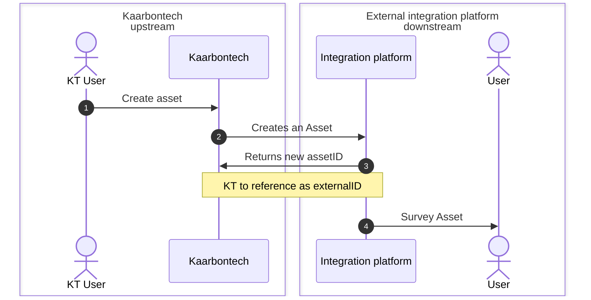

### Update Asset
<a href="#mainTable" style="font-size: 0.8em">Back to main table</a>

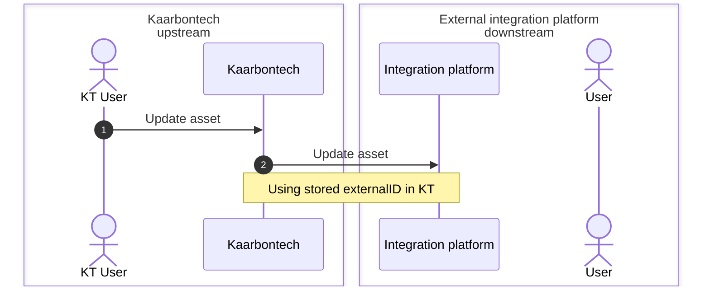

### New Asset with Integration Platform confirmation
<a href="#mainTable" style="font-size: 0.8em">Back to main table</a>

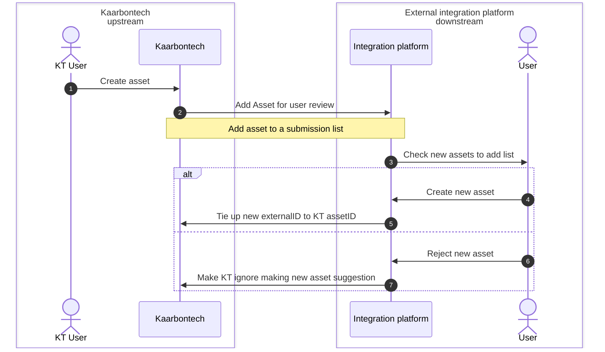

### Create Inspection
<a href="#mainTable" style="font-size: 0.8em">Back to main table</a>

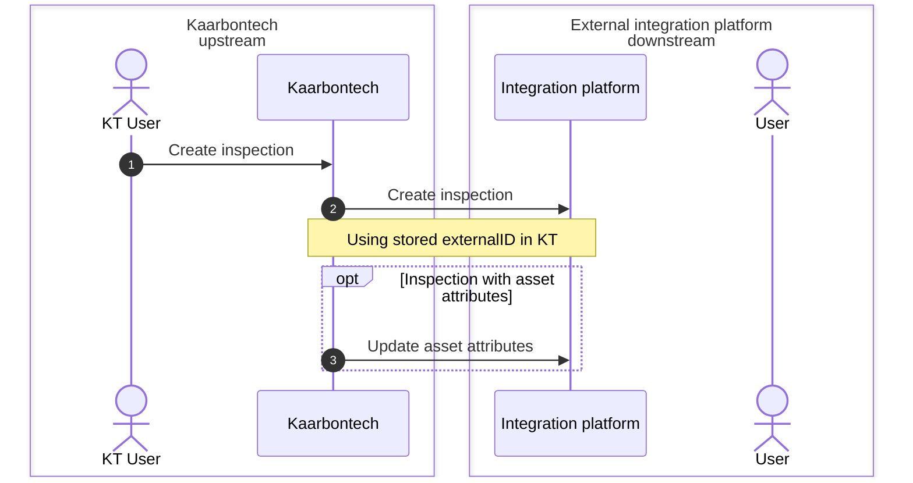

### Update Inspection
<a href="#mainTable" style="font-size: 0.8em">Back to main table</a>

> [!IMPORTANT]
> **Note** We currently do not store external client inspection id for
  updating. So we would have to rely on external client holding our
  **inspectionID**.

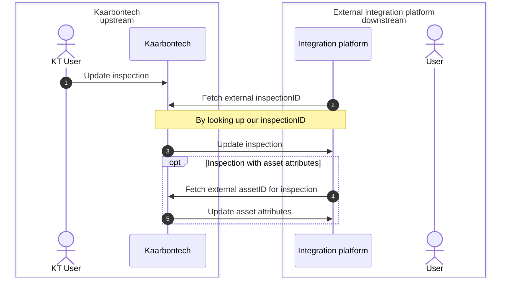

### Create Service Request
<a href="#mainTable" style="font-size: 0.8em">Back to main table</a>

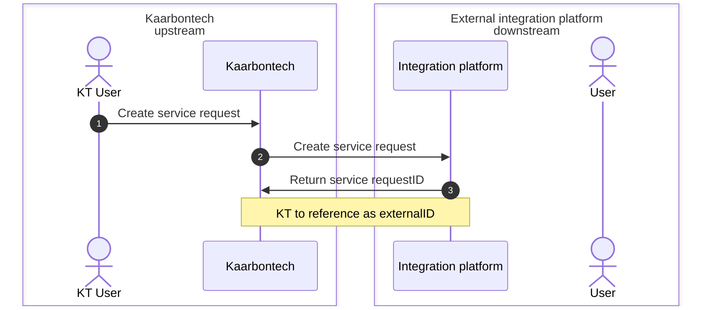

### Update Service Request
<a href="#mainTable" style="font-size: 0.8em">Back to main table</a>

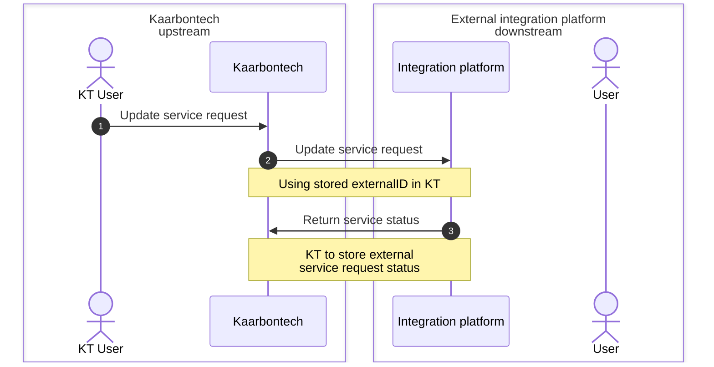
## Kaarbontech Downstream

### Create Asset
<a href="#mainTable" style="font-size: 0.8em">Back to main table</a>

### Update Asset
<a href="#mainTable" style="font-size: 0.8em">Back to main table</a>

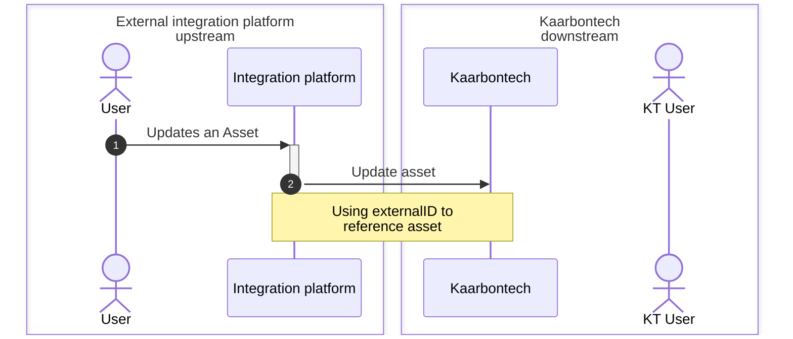

### Create Inspection
<a href="#mainTable" style="font-size: 0.8em">Back to main table</a>

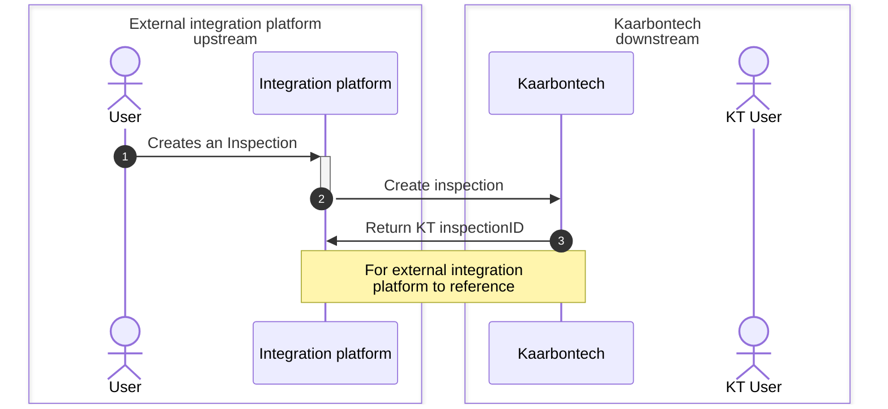

### Update Inspection
<a href="#mainTable" style="font-size: 0.8em">Back to main table</a>

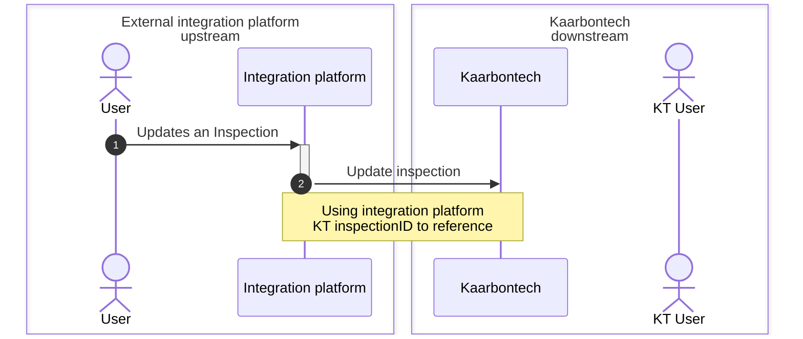

### Inspection Downsteam KT, Asset Upstream KT
<a href="#mainTable" style="font-size: 0.8em">Back to main table</a>

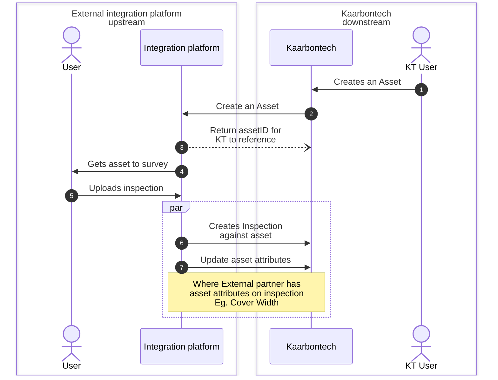

### Create Service Request
<a href="#mainTable" style="font-size: 0.8em">Back to main table</a>

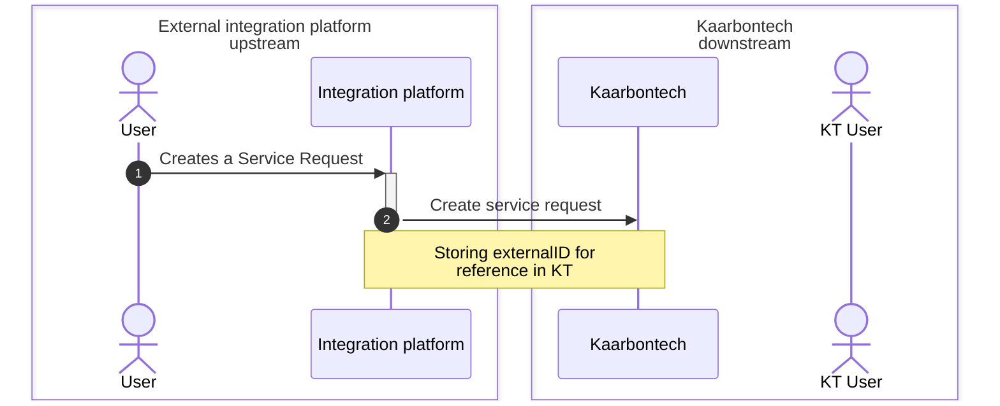

### Update Service Request
<a href="#mainTable" style="font-size: 0.8em">Back to main table</a>

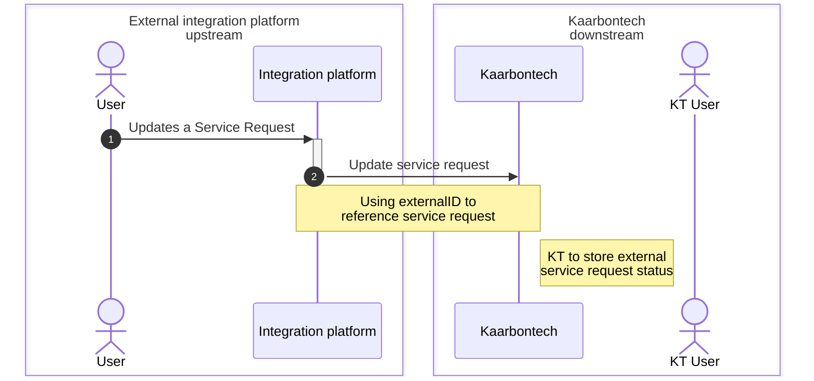
